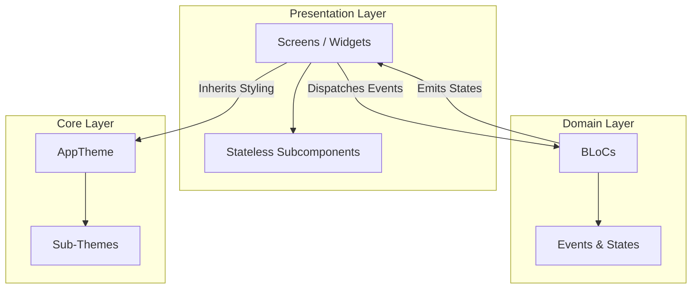

# CRM Agent - Application Architecture

This document describes the architectural layout, state management design, and coding practices implemented in the CRM Agent Flutter application.

---

## 1. Architectural Overview

The CRM Agent application is structured to enforce a clean separation of concerns, testability, and modularity. It adheres to a **Layered Architecture** style, splitting elements into **Presentation**, **Domain (BLoC)**, and **Core/Theme** layers, with a file length constraint of **under 80 lines of code** per file to guarantee modularity.



---

## 2. Key Design Principles

### 2.1 BLoC Pattern (Business Logic Component)
All business logic, form validation, timers, and state transitions are decoupled from the user interface using the `flutter_bloc` package. 
- **Uniform Data Flow**: The UI dispatches **Events** to the BLoC; the BLoC processes business logic asynchronously and emits **States** back to the UI.
- **Stateless UI**: Extracted UI widgets strictly extend `StatelessWidget`. UI components only read state from BLoC stream builders (`BlocBuilder`, `BlocListener`) and avoid using local mutable state (`StatefulWidget`'s `setState`), keeping code clean and reactive.

### 2.2 Library Decomposition (Part / Part Of Directives)
To group related BLoC files into a single logical library, we utilize Dart's `part` and `part of` directives:
- The **Primary BLoC file** (e.g. `login_bloc.dart`) acts as the library header. It manages package imports and declares references using `part 'filename.dart';`.
- The **Event and State files** (e.g., `login_event.dart`, `login_state.dart`) declare `part of 'login_bloc.dart';` at the top and do not contain independent imports.
- External widgets only need to import the primary BLoC file to get access to the entire library.

### 2.3 Strict File Length Constraint (< 80 Lines)
All coding files are strictly limited to **under 80 lines of code**. Large layouts, widget builds, and design setups are decomposed into smaller sub-files:
- **Theme** is split into colors, text themes, buttons, shadows, and inputs.
- **Login screen** is split into inputs, header, body, buttons, and alert banners.
- **Splash screen** is split into animations, loader, and logo contents.

### 2.4 Accessibility (A11Y)
Visual elements are wrapped in `Semantics` widgets to provide clean and contextual metadata labels for screen readers (VoiceOver/TalkBack). High-priority announcements (like validation failures) are designated as semantic live regions.

---

## 3. Layered breakdown

### 3.1 Presentation Layer (`lib/screens/`)
Coordinates widgets and renders visual elements.

- **Screens**:
  - `SplashScreen`: Initiates startup animations and BLoC load triggers.
  - `LoginScreen`: Stateful only to manage the creation/disposal of text controllers, using `LoginBody` for layouts.
- **Modular Subcomponents** (`lib/screens/login/` & `lib/screens/splash/`):
  - `PhoneField` / `PasswordField`: Handle user text inputs.
  - `SignInButton`: Clickable target triggering validation.
  - `SplashAnimator`: Performs scale-in and fade-in entries.

### 3.2 Domain Layer (`lib/bloc/`)
Orchestrates business logic and maps inputs to outputs.

- **Splash BLoC**:
  - Event: `StartSplash`
  - States: `SplashInitial` -> `SplashLoading` -> `SplashNavigateToLogin`
  - Logic: Triggers a 3-second delay simulating branding displays, then instructs the UI to route to the login screen.
- **Login BLoC**:
  - Events: `TogglePasswordVisibility`, `LoginSubmitted`, `ClearLoginError`
  - State: `LoginState` (stores obscure status, success flags, and error string values).
  - Logic: Validates inputs (non-empty fields) and triggers mock success notifications.

### 3.3 Core & Theme Layer (`lib/theme/`)
Exposes visual design tokens.

- `AppColors`: Primary reds (`#E53935`), dark slates (`#1E293B`), and neutral backgrounds.
- `AppShadows`: BoxShadow definitions to create depth.
- `AppTextTheme` / `AppInputTheme` / `AppButtonTheme`: Theme components styling text typography, input fields, and elevated button shapes.
- `AppTheme`: Main integrator building global theme profiles.

---

## 4. Workflows

### 4.1 Startup & Splash Transition Sequence
```mermaid
sequenceTransition
    App Start -> SplashScreen: Init
    SplashScreen -> SplashBloc: Dispatch StartSplash Event
    SplashBloc -> SplashBloc: Emit SplashLoading State
    SplashScreen -> SplashLoader: Render Spinner
    SplashBloc -> SplashBloc: Await 3-Second Delay
    SplashBloc -> SplashBloc: Emit SplashNavigateToLogin State
    SplashScreen -> LoginScreen: PushReplacement
```

### 4.2 Login Validation Workflow
```mermaid
sequenceTransition
    User -> SignInButton: Tap
    SignInButton -> LoginBloc: Dispatch LoginSubmitted Event
    alt Empty Inputs
        LoginBloc -> LoginBloc: Emit LoginState(errorMessage)
        LoginBody -> ErrorBanner: Render Warning
    else Valid Inputs
        LoginBloc -> LoginBloc: Emit LoginState(isSuccess: true)
        LoginScreen -> SnackBar: Show Success Message
    end
```

---

## 5. Testing Strategy

We run widget tests in `test/widget_test.dart` to assert state workflows:
1. **Initial Render**: Verify `SplashScreen` loads the brand name and tagline.
2. **RichText Matching**: Because brand names utilize styled nested text spans (`CRM Agent`), tests utilize custom widget predicates to inspect plain text values:
   ```dart
   find.byWidgetPredicate((widget) => widget is RichText && widget.text.toPlainText().contains('CRM Agent'))
   ```
3. **Navigation Test**: Advance the test clocks by 3 seconds (`tester.pump(Duration)`), letting BLoC trigger transition states, and verify that the app routes to `LoginScreen` displaying inputs.
